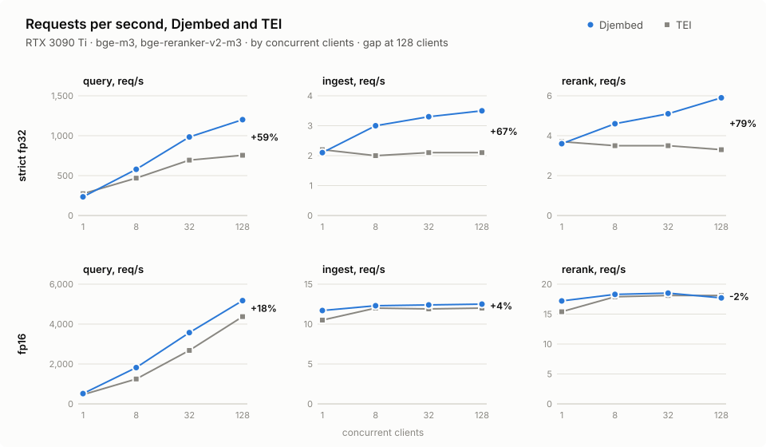

<picture>
  <source media="(prefers-color-scheme: dark)" srcset="banner-dark.svg">
  
</picture>


Distributed Java Embeddings: an ONNX Runtime server for embedding and reranking models, with Cohere and OpenAI
compatible APIs.

## Why

- **One server, both standards.** Cohere `/v1|v2/embed` and `/v1|v2/rerank`, OpenAI `/v1/embeddings` and
  `/v1/models`: existing Cohere and OpenAI clients work unchanged, for embeddings and reranking alike.
- **No performance trade-off.** On the same GPU, up to 1.8× the throughput of Text Embeddings Inference and 6× that
  of Infinity, never more than 15% behind (see [Benchmark](#benchmark)).
- **Java end to end.** Server and embeddable library on the JVM, no Python runtime: off-heap buffers, batching across
  requests, any ONNX model on CPU or CUDA.

## Configuration

| Key | Default | Description |
|---|---|---|
| `server.host` | `0.0.0.0` | Bind address |
| `server.port` | `8080` | HTTP port |
| `server.max-request-bytes` | `33554432` | Largest request body |
| `server.request-timeout-ms` | `60000` | Per request, queueing included; `0` disables it |
| `server.api-keys` | none | Accepted bearer tokens; none leaves the API open (`/health`, `/metrics` always are) |
| `models[].name` | — | Value of the `model` request field |
| `models[].task` | — | `embed` or `rerank` |
| `models[].path` | — | Model directory, relative to the config file |
| `models[].device` | `cpu` | `cpu`, `cuda` or `cuda:N` |
| `models[].max-batch-size` | `1024` | Sequences per forward pass |
| `models[].token-budget` | `16384` | Tokens per forward pass, padding included unless the model is in ONNX Runtime packing mode |
| `models[].max-input-tokens` | model limit | Tokens per sequence; lower it to bound attention memory |
| `models[].max-queued-inputs` | `8192` | Inputs queued before answering `503` |
| `models[].tf32` | `true` | CUDA: TensorFloat-32 matrix multiplications; `false` for strict fp32 |
| `models[].long-input` | `truncate` | Embed: `truncate`, or `chunk` into averaged windows |
| `models[].pooling` | from model | Embed: `cls`, `mean` or `last_token`, when the graph does not pool |
| `models[].normalize` | `true` | Embed: L2-normalise vectors |
| `models[].activation` | `sigmoid` | Rerank: `sigmoid` or `none` (raw logit) |

| Environment variable | Description |
|---|---|
| `DJEMBED_CONFIG` | Config file when no CLI argument is given (default `./djembed.yaml`) |
| `DJEMBED_API_KEYS` | Comma-separated API keys, added to `server.api-keys` |

See `djembed.example.yaml` and `docker/`. Prometheus metrics are served at `/metrics`.

## Docker

`ragulabs/djembed` on Docker Hub needs an NVIDIA GPU and the NVIDIA Container Toolkit. Models ready for it, fp16 in
packing mode, are published as
[`ragulabs-org/bge-m3-onnx-fp16-packed`](https://huggingface.co/ragulabs-org/bge-m3-onnx-fp16-packed) and
[`ragulabs-org/bge-reranker-v2-m3-onnx-fp16-packed`](https://huggingface.co/ragulabs-org/bge-reranker-v2-m3-onnx-fp16-packed).

```
hf download ragulabs-org/bge-m3-onnx-fp16-packed --local-dir models/bge-m3
hf download ragulabs-org/bge-reranker-v2-m3-onnx-fp16-packed --local-dir models/bge-reranker-v2-m3
docker run --gpus all -p 8080:8080 -e DJEMBED_API_KEYS=change-me \
  -v "$PWD/models:/models:ro" -v "$PWD/djembed.yaml:/etc/djembed/djembed.yaml:ro" ragulabs/djembed
```

with `djembed.yaml` as `djembed.example.yaml`, paths under `/models`.

## Using the core in a Java application

`djembed-core` runs the same engines in-process. It needs Java 25 and either `onnxruntime` (CPU) or `onnxruntime_gpu`
(CUDA 12, cuDNN 9).

```groovy
dependencies {
    implementation 'com.ragulabs.djembed:djembed-core:0.1.0'
    runtimeOnly 'com.microsoft.onnxruntime:onnxruntime_gpu:1.29.0'
}
```

```xml
<dependency>
    <groupId>com.ragulabs.djembed</groupId>
    <artifactId>djembed-core</artifactId>
    <version>0.1.0</version>
</dependency>
<dependency>
    <groupId>com.microsoft.onnxruntime</groupId>
    <artifactId>onnxruntime_gpu</artifactId>
    <version>1.29.0</version>
    <scope>runtime</scope>
</dependency>
```

Snapshots are at `https://central.sonatype.com/repository/maven-snapshots/`. Run the JVM with
`--enable-native-access=ALL-UNNAMED`.

```java
EngineOptions gpu = EngineOptions.defaults().withDevice(Device.cuda(0));

try (EmbeddingEngine embedder = OnnxEmbeddingEngine.load(Path.of("models/bge-m3"),
             EmbeddingOptions.defaults().withEngine(gpu));
     RerankEngine reranker = OnnxRerankEngine.load(Path.of("models/bge-reranker-v2-m3"),
             RerankOptions.defaults().withEngine(gpu))) {

    Embeddings embeddings = embedder.embed(List.of("The cat sleeps on the sofa.", "Quarterly revenue grew 4%."));
    float[] first = embeddings.vector(0);

    RerankScores scores = reranker.score("Where does the cat sleep?",
            List.of("Quarterly revenue grew 4%.", "The cat sleeps on the sofa."));
    float relevance = scores.score(1);

    CompletableFuture<Embeddings> pending = embedder.embedAsync(List.of("Non-blocking call"));
}
```

Engines are thread-safe: share one per model and concurrent calls are batched together. A model directory holds
`model.onnx` (or `onnx/model.onnx`), `tokenizer.json` and `config.json`. The options records mirror the `models[]`
keys.

## Benchmark

`djembed-bench` sends identical, seeded requests to each server at the same precision on the same GPU, after checking
that their outputs agree. Each round mirrors what the other server computes (see `djembed-bench/docker-compose.yml`):
strict fp32 against TEI by default; fp16 with `BENCH_MODEL_SUFFIX=-fp16-packed` and `BENCH_TEI_DTYPE=float16` or
`BENCH_INFINITY_DTYPE=float16`. Packed models are built by `djembed-bench/export-packed.sh <models dir> <fp16|fp32>`.

```
# against TEI
DJEMBED_MODELS=/path/to/models docker compose -f djembed-bench/docker-compose.yml up --build -d djembed tei-embed tei-rerank
./gradlew :djembed-bench:run --args="--djembed http://localhost:8080 --tei-embed http://localhost:8081 --tei-rerank http://localhost:8082 --gpu 0"

# against Infinity
DJEMBED_MODELS=/path/to/models docker compose -f djembed-bench/docker-compose.yml up --build -d djembed infinity
./gradlew :djembed-bench:run --args="--djembed http://localhost:8080 --infinity http://localhost:8083 --gpu 0"
```

| Option | Default | Description |
|---|---|---|
| `--workloads` | `query,ingest,rerank` | 1 short text; 32 passages; a query and 32 documents |
| `--concurrency` | `1,8,32,128` | Closed-loop clients |
| `--warmup` / `--duration` | `15s` / `60s` | Per run |
| `--seed` | `42` | Corpus seed |
| `--gpu` | none | GPU to sample with `nvidia-smi` (on the GPU host) |
| `--api-key` | none | Djembed API key |

### Results

RTX 3090 Ti, Djembed 0.1.0, TEI 1.9, Infinity 0.0.77 (torch engine), `BAAI/bge-m3@5617a9f` and
`BAAI/bge-reranker-v2-m3@953dc6f`. Outputs agree: embedding cosine ≥ 0.99994, rerank scores within 0.0037.

<picture>
  <source media="(prefers-color-scheme: dark)" srcset="djembed-bench/results/throughput-dark.svg">
  
</picture>

Djembed throughput relative to each server at 1 / 8 / 32 / 128 concurrent clients:

| | TEI fp16 | Infinity fp16 | TEI strict fp32 |
|---|---|---|---|
| query | 1.11 / 1.46 / 1.33 / 1.18× | 5.96 / 4.50 / 5.48 / 5.90× | 0.85 / 1.24 / 1.42 / 1.59× |
| ingest | 1.11 / 1.03 / 1.04 / 1.04× | 1.15 / 1.05 / 1.06 / 1.08× | 0.97 / 1.52 / 1.54 / 1.71× |
| rerank | 1.12 / 1.02 / 1.02 / 0.98× | 1.17 / 1.03 / 1.09 / 1.03× | 0.96 / 1.33 / 1.46 / 1.78× |

- **fp16**: all three skip padding and meet the GPU's fp16 ceiling on batches; Djembed leads on per-request overhead,
  most on short queries, where Infinity keeps the GPU under 50% busy.
- **strict fp32**: both pad; Djembed batches across requests by length, computing less padding.

Latencies and full tables: [TEI fp16](djembed-bench/results/2026-09-29-rtx3090ti-tei-fp16.md),
[TEI fp32](djembed-bench/results/2026-09-29-rtx3090ti-tei-fp32.md),
[Infinity fp16](djembed-bench/results/2026-09-29-rtx3090ti-infinity-fp16.md).
